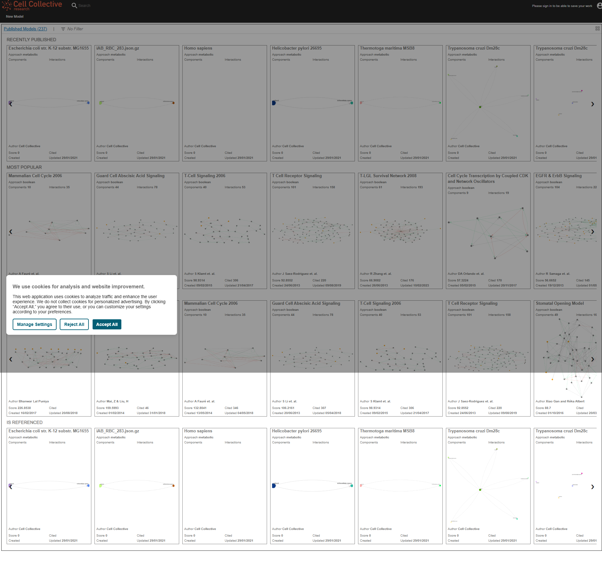

# Cell Collective Research Dashboard - Comprehensive Analysis

**Analysis Date:** [To be populated]
**Platform:** https://research.cellcollective.org/research/dashboard/
**Purpose:** K-12 Educational Wrapper Implementation

---

## 🎯 Executive Summary

This document provides a complete technical analysis of the Cell Collective research dashboard to enable creation of a K-12 educational wrapper that:
- Hides researcher-level complexity
- Maintains core modeling functionality
- Provides age-appropriate interface simplifications
- Can be embedded in educational platforms

---

## 📋 Table of Contents

1. [Iframe Compatibility Analysis](#iframe-compatibility-analysis)
2. [DOM Structure & Selectors](#dom-structure--selectors)
3. [CSS Hiding Strategy](#css-hiding-strategy)
4. [JavaScript Control Triggers](#javascript-control-triggers)
5. [Network API Analysis](#network-api-analysis)
6. [Model Builder Interface](#model-builder-interface)
7. [Implementation Recommendations](#implementation-recommendations)
8. [Technical Constraints](#technical-constraints)

---

## 🔒 Iframe Compatibility Analysis

### HTTP Headers Analysis

**X-Frame-Options:**
```
[To be populated from analysis]
```

**Content-Security-Policy:**
```
[To be populated from analysis]
```

**CORS Configuration:**
```
[To be populated from analysis]
```

### Iframe Loading Test Results

✅ **Can Load in Iframe:** [Yes/No]

**Restrictions Found:**
- [List any restrictions]

**Workarounds Available:**
- [List potential workarounds]

---

## 🏗️ DOM Structure & Selectors

### Header Elements (TO HIDE)

```html
<!-- Primary Header -->
[To be populated with actual selectors]

<!-- User Profile Menu -->
[To be populated with actual selectors]

<!-- Admin Navigation -->
[To be populated with actual selectors]
```

**CSS Selectors to Hide:**
```css
/* Header elements */
[To be populated]

/* Navigation menus */
[To be populated]

/* User controls */
[To be populated]
```

### Main Content Areas (TO KEEP)

```html
<!-- Model Canvas/Workspace -->
[To be populated with actual selectors]

<!-- Simulation Viewer -->
[To be populated with actual selectors]

<!-- Essential Controls -->
[To be populated with actual selectors]
```

**CSS Selectors to Preserve:**
```css
/* Model canvas */
[To be populated]

/* Simulation area */
[To be populated]

/* Basic controls */
[To be populated]
```

### Sidebar Elements

**Left Sidebar:**
- Purpose: [To be documented]
- Selector: [To be populated]
- Action: [Hide/Keep/Simplify]

**Right Sidebar:**
- Purpose: [To be documented]
- Selector: [To be populated]
- Action: [Hide/Keep/Simplify]

### Footer Elements

[To be populated]

---

## 🎨 CSS Hiding Strategy

### Complete CSS Override

```css
/*
 * Cell Collective K-12 Wrapper Stylesheet
 * Hides researcher-level complexity while maintaining core functionality
 */

/* =================================
   ELEMENTS TO HIDE
   ================================= */

/* Header and top navigation */
[To be populated from analysis]

/* Complex menus */
[To be populated from analysis]

/* Researcher controls */
[To be populated from analysis]

/* Advanced features */
[To be populated from analysis]


/* =================================
   ELEMENTS TO KEEP & ENHANCE
   ================================= */

/* Model canvas - maximize space */
[To be populated from analysis]

/* Simulation viewer - prominent display */
[To be populated from analysis]

/* Essential controls - simplify styling */
[To be populated from analysis]


/* =================================
   K-12 FRIENDLY ENHANCEMENTS
   ================================= */

/* Larger buttons for touch/accessibility */
[To be populated]

/* Simplified color scheme */
[To be populated]

/* Clear visual hierarchy */
[To be populated]
```

### Element-Specific Hiding Rules

| Element Type | Selector | Reason | Alternative |
|-------------|----------|---------|-------------|
| [Type] | [Selector] | [Why hide] | [K-12 version] |

---

## ⚙️ JavaScript Control Triggers

### Core Model Operations

#### Creating a New Model

**Method 1: Button Click**
```javascript
[To be populated with actual code]
```

**Method 2: Programmatic API**
```javascript
[To be populated with actual code]
```

#### Adding Components to Model

**Node/Component Creation:**
```javascript
[To be populated with actual code]
```

**Setting Component Properties:**
```javascript
[To be populated with actual code]
```

#### Creating Connections

**Edge/Connection Creation:**
```javascript
[To be populated with actual code]
```

**Connection Types:**
- Activation: [Code]
- Inhibition: [Code]
- Custom: [Code]

#### Running Simulations

**Start Simulation:**
```javascript
[To be populated with actual code]
```

**Simulation Parameters:**
```javascript
[To be populated with actual code]
```

**Reading Results:**
```javascript
[To be populated with actual code]
```

#### Saving Models

**Save Current Model:**
```javascript
[To be populated with actual code]
```

**Export Model:**
```javascript
[To be populated with actual code]
```

### Event Listener Mapping

| User Action | Event | Selector | Handler Function |
|-------------|-------|----------|------------------|
| [Action] | [Event] | [Selector] | [Function name] |

---

## 🌐 Network API Analysis

### API Endpoints Discovered

**Base URL:** [To be populated]

#### Model Management
```
GET  /api/models         - List models
POST /api/models         - Create model
GET  /api/models/{id}    - Get model
PUT  /api/models/{id}    - Update model
DEL  /api/models/{id}    - Delete model
```

#### Simulation
```
POST /api/simulate       - Run simulation
GET  /api/simulate/{id}  - Get simulation results
```

#### Component Library
```
GET  /api/components     - List available components
```

### Request/Response Examples

**Create Model Request:**
```json
[To be populated]
```

**Create Model Response:**
```json
[To be populated]
```

### Authentication Requirements

- **Cookie-based:** [Yes/No]
- **Token-based:** [Yes/No]
- **Session management:** [Details]

---

## 🎨 Model Builder Interface

### Canvas Technology

- **Rendering Engine:** [Canvas/SVG/WebGL]
- **Library Used:** [e.g., D3.js, Cytoscape.js, custom]
- **Canvas Selector:** [To be populated]

### Canvas Dimensions

```javascript
{
  width: [pixels],
  height: [pixels],
  viewBox: [SVG viewBox if applicable]
}
```

### Toolbar Elements

| Tool | Selector | Function | Keep for K-12? |
|------|----------|----------|----------------|
| [Tool name] | [Selector] | [Function] | [Yes/No] |

### Component Palette

**Available Components:**
- [Component 1]: [Description]
- [Component 2]: [Description]
- [Component 3]: [Description]

**Selectors:**
```javascript
[To be populated]
```

---

## 💡 Implementation Recommendations

### Architecture Approach

**Recommended:** [Iframe Wrapper / Proxy Server / Hybrid]

**Rationale:**
[To be populated based on analysis findings]

### Step-by-Step Implementation

1. **Phase 1: Basic Iframe Integration**
   - Load dashboard in iframe
   - Apply CSS hiding rules
   - Test basic functionality

2. **Phase 2: Control Simplification**
   - Replace complex controls with K-12 versions
   - Add educational scaffolding
   - Implement student-friendly help

3. **Phase 3: Feature Enhancement**
   - Add pre-built model templates
   - Integrate lesson plans
   - Build progress tracking

4. **Phase 4: Polish & Deploy**
   - User testing with students
   - Accessibility improvements
   - Production deployment

### Code Example: Basic Wrapper

```html
<!DOCTYPE html>
<html lang="en">
<head>
    <meta charset="UTF-8">
    <title>Cell Collective K-12 Wrapper</title>
    <style>
        /* CSS from analysis */
        [To be populated]
    </style>
</head>
<body>
    <div id="k12-wrapper">
        <div id="simplified-toolbar">
            <!-- K-12 friendly controls -->
        </div>
        <iframe
            id="cell-collective-frame"
            src="https://research.cellcollective.org/research/dashboard/"
            style="width: 100%; height: 600px; border: none;">
        </iframe>
    </div>

    <script>
        // Control injection
        [To be populated]
    </script>
</body>
</html>
```

---

## ⚠️ Technical Constraints

### Known Limitations

1. **Iframe Restrictions:**
   - [List specific restrictions]

2. **JavaScript Sandboxing:**
   - [Security limitations]

3. **CORS Issues:**
   - [Cross-origin constraints]

4. **Authentication:**
   - [Login requirements]

### Workarounds

| Constraint | Workaround | Implementation Effort |
|------------|------------|----------------------|
| [Constraint] | [Solution] | [Low/Medium/High] |

### Browser Compatibility

| Browser | Version | Status | Notes |
|---------|---------|--------|-------|
| Chrome | Latest | [✅/❌] | [Notes] |
| Firefox | Latest | [✅/❌] | [Notes] |
| Safari | Latest | [✅/❌] | [Notes] |
| Edge | Latest | [✅/❌] | [Notes] |

---

## 📸 Screenshots

### Dashboard Home


### Model Builder Interface


### Simulation View


---

## 🔍 Appendix: Raw Analysis Data

### Full DOM Tree
[Link to JSON file]

### Complete Network Trace
[Link to HAR file]

### JavaScript Object Inspection
[Link to analysis output]

---

## 📝 Next Steps

- [ ] Verify all selectors in production environment
- [ ] Test CSS hiding rules across browsers
- [ ] Develop JavaScript control wrappers
- [ ] Create student-facing UI mockups
- [ ] Build prototype wrapper
- [ ] Conduct user testing with K-12 students
- [ ] Refine based on feedback
- [ ] Deploy production version

---

**Analysis Conducted By:** Claude Code (Code Analyzer Agent)
**Last Updated:** [Date]
**Status:** [In Progress / Complete]
